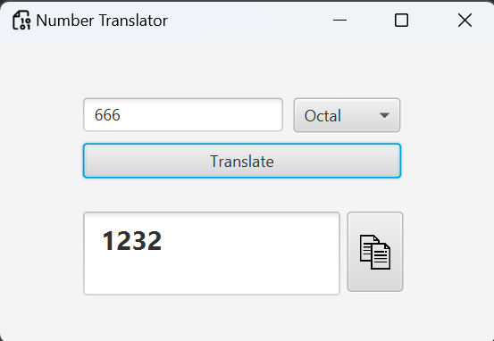

# JavaFX-number-translations
Translate your number from decimal to binary, octal and hexadecimal
# <Your Project Name>

## Description

## Features

- **Number Calculator:** Perform basic mathematical operations on numbers.

- **Translate Function:** Convert decimal numbers to binary, octal, and hexadecimal.

- **Clipboard Integration:** Easily copy translated numbers to the clipboard.

## Technologies Used

- JavaFX: The project is built using JavaFX, a powerful framework for building interactive and visually appealing Java applications.

## Screenshots/Demo

## Getting Started

### Prerequisites

- Java Development Kit (JDK) installed
- IDE

### Installation

1. Clone the repository: git clone https://github.com/adamhitzger/JavaFX-number-translations.git
